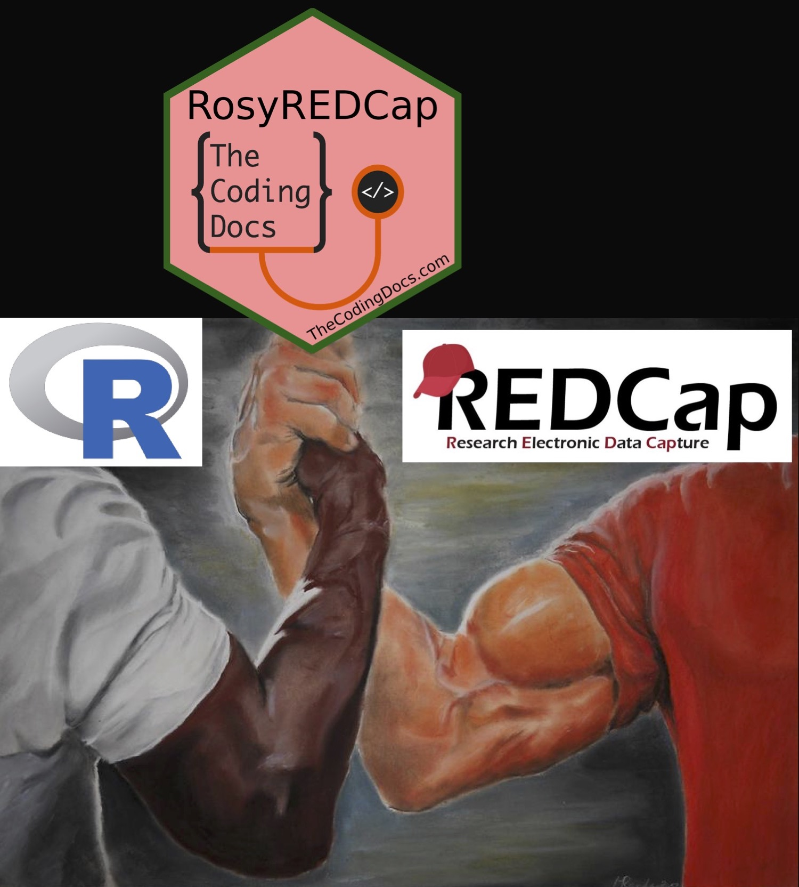

<!-- README.md is generated from README.Rmd. Please edit that file -->

```{r, include = FALSE}
knitr::opts_chunk$set(
  collapse = TRUE,
  comment = "#>",
  fig.path = "man/figures/README-",
  out.width = "100%"
)
```

# RosyREDCap 

<!-- badges: start -->

[](https://lifecycle.r-lib.org/articles/stages.html#experimental)
[](https://github.com/brandonerose/RosyREDCap/actions/workflows/R-CMD-check.yaml)
[](https://app.codecov.io/gh/brandonerose/RosyREDCap)
<!-- badges: end -->

Use your REDCap API tokens to create an updating R list object (DB) which can used downstream for analysis, data exports, shiny apps, and data imports!
Rosy with a capital 'R' evokes the R statistical programming language, the primary developer's last name, and the idea of making something more beautiful and user-friendly.
This prefix combined with REDCap demonstrates the package's goal of enhancing the REDCap experience by creating data tools that are powerful and pleasant to use, combining the best of R with best REDCap.

At this time this package is **not suited for Multi-Arm projects or massive REDCap projects yet**.
More to come in future versions!
The core functions are stable but future development and changes are possible.

## Minimum Requirements

-   R (and ideally RStudio) installed on your computer.
-   Access to at least one REDCap project (real or test) with API Token Privileges according to User Rights.
-   Permission to export and analyze date for this project.



# What is `{RosyREDCap}`?

R and REDCap are both widely utilized in medicine, including basic science, clinical research, and clinal trials.
Both have independent strengths, but together they can create powerful data pipelines.
While several R packages exist for extracting data using the REDCap API, `{RosyREDCap}` stands out by offering comprehensive extraction of all metadata and data from any REDCap project into a standardized R list object, facilitating effortless downstream use in exports, imports, transformation, and applications.
This is showcased in the exploratory data analysis shiny app included in the package.
The three core aims of `{RosyREDCap}` are to...

1.  Maintain a local version of the database (DB) object by only calling recently updated records using the REDCap log.
2.  Allow imports of non-coded versions of the dataset using R or Excel/CSV.
3.  Launch a shiny app that allows you to explore all of your REDCap projects.

By leveraging the combined strengths of R and REDCap, users can maintain strong clinical data pipelines, collected and processed appropriately to improve research and patient care.
RosyREDCap can be used as a base data object and data quality tool for most REDCap projects to aid in collection, monitoring, transformation, and analysis.

## Installing RosyREDCap

*Note: The current version of `{RosyREDCap}` used when writing this book is `r packageVersion("RosyREDCap")`, and some of the features presented in this book might not be available if you are using an older version, or be a little bit different if you have a newer version. Feel free to browse the package NEWS.*

The stable release can be found on CRAN and installed with: **PLACEHOLDER NOT SUBMITTED TO CRAN YET**

```{r, eval=FALSE}
#install.packages("RosyREDCap") #PLACEHOLDER NOT SUBMITTED TO CRAN YET
```

You can install the development version of RosyREDCap from GitHub by using the `{remotes}` package.
Be sure to install `{remotes}` if you don't have it already.

```{r, eval=FALSE}
#install.packages("remotes)
remotes::install_github("brandonerose/RosyREDCap",build_vignettes = T,build_manual = T)
```

Note that the version used at the time of writing this book is `r packageVersion("RosyREDCap")`.
You can check what version you have installed with the following.

```{r}
packageVersion("RosyREDCap")
```

If you have any issues, try downloading the most recent version of R at RStudtio and update all packages in RStudio.
See [thecodingdocs.com/r/getting-started](https://www.thecodingdocs.com/r/getting-started "R Getting Started").

## Getting Started

```{r example, eval=FALSE}
library("RosyREDCap")

projects <- get_projects() # get list of cached projects
print.data.frame(projects) # show your previously saved projects

your_project_path <- getwd()
print(your_project_path) # confirm this is where you want files saved

DB <- setup_DB(
  short_name = "TEST_repeating",
  redcap_base = "https://redcap.yourinstitution.edu/", # change to your institutions link (stop at ".edu/")
  dir_path = getwd() # or change to your intended file path
) #defaults will autocheck for valid token or ask you.

#if you had to set a token above you might need to select the code below again for it to run
DB <- update_DB(DB) # update from redcap by checking log and using saved object 

DB <- DB %>% deidentify_DB(drop_free_text = F) %>% drop_REDCap_to_directory() # will save DEIDENTIFIED data (assuming this is set up properly on REDCap)
#use drop_free_text = T to be even safer

# DB <- drop_REDCap_to_directory(DB) # will save IDENTIFIED data (assuming this is set up properly on REDCap)

#run shiny app!
run_RosyREDCap() # will work with multiple REDCap projects!
```

## Links

-   The RosyREDCap package is at [github.com/brandonerose/RosyREDCap](https://github.com/brandonerose/RosyREDCap "RosyREDCap R package"). See instructions above.
-   Donate if I helped you out and want more development (anything helps)! [account.venmo.com/u/brandonerose](https://account.venmo.com/u/brandonerose "Venmo Donation")
-   For more R coding visit [TheCodingDocs.com](https://www.thecodingdocs.com/ "TheCodingDocs.com")
-   For correspondence/feedback/issues, please email [TheCodingDocs\@gmail.com](mailto:TheCodingDocs@gmail.com)!
-   Follow us on Twitter [twitter.com/TheCodingDocs](https://twitter.com/TheCodingDocs "TheCodingDocs Twitter")
-   Follow me on Twitter [twitter.com/BRoseMDMPH](https://twitter.com/BRoseMDMPH "BRoseMDMPH Twitter")

[](http://www.thecodingdocs.com)
